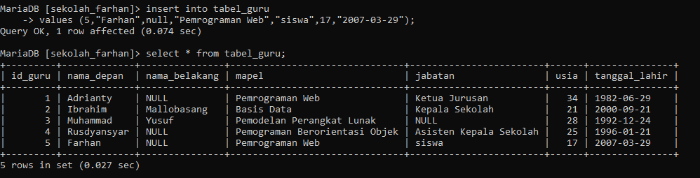

# Soal 1
## Query 

```mysql
CREATE TABLE tabel_guru (
id_guru int (10) primary key not null,
nama_depan varchar(25) not null,
nama_belakang varchar(25) null,
mapel varchar(50) not null,
jabatan varchar(30) null,
usia int(10) not null,
tanggal_lahir varchar(30) not null);
```

## Hasil


## Analisis 

- Kolom `id_guru` adalah kunci utama, memastikan bahwa setiap catatan dalam `tabel_guru` tabel adalah unik dan bukan nol. Ini sesuai untuk kunci utama.

- Dalam SQL, penentu panjang untuk tipe integer (misal, `int(10)`) tidak membatasi jumlah digit. Sebaliknya, ini mungkin digunakan untuk lebar tampilan di beberapa sistem database tetapi umumnya diabaikan di sistem modern. Oleh karena itu, penspesifikasian `int(10)` tidak mempunyai efek praktis.

- Panjang bidang varchar (25 for `nama_depan` and `nama_belakang`, 50 for `mapel`, 30 for `jabatan`, dan `tanggal_lahir`) tampaknya masuk akal tetapi harus didasarkan pada kebutuhan data aktual. Penyesuaian mungkin diperlukan berdasarkan panjang khas bidang ini.

- Kolom seperti `nama_depan`, `mapel`, `usia`, dan `tanggal_lahir` ditandai sebagai `not null`, yang memastikan bahwa bidang ini harus memiliki nilai ketika catatan disisipkan.

- Kolom seperti `nama_belakang` dan `jabatan` boleh bernilai nol, sehingga memberikan fleksibilitas untuk rekaman jika detail ini mungkin tidak tersedia atau tidak dapat diterapkan.

- Kolom `tanggal_lahir` didefinisikan sebagai `varchar(30)`. Meskipun hal ini memungkinkan fleksibilitas dalam menyimpan format tanggal, hal ini tidak ideal untuk operasi tanggal (misalnya, pengurutan, perbandingan). Menggunakan tipe data tanggal yang tepat ( `DATE` atau `DATETIME`) akan lebih tepat dan akan menjamin konsistensi data.

## Kesimpulan 

Membuat `tabel_guru`tabel dengan berbagai kolom, termasuk kunci utama, bidang teks, dan bidang bilangan bulat. Peningkatan utama mencakup penggunaan `DATE`tanggal lahir dan menghapus penentu panjang bilangan bulat yang tidak perlu. Perubahan ini meningkatkan integritas data dan keselarasan dengan praktik terbaik.

# Soal 2
## Query 

```mysql
INSERT INTO tabel_guru

values (1, "Adrianty", NULL, "Pemograman Web", "Ketua Jurusan", 34, "1982-06-29");

INSERT INTO tabel_guru

values (2, "Ibrahim", "Mallombasang", "Basis Data", "Kepala Sekolah", 21, "2000-09-21"),
(3, "Muhammad", "Yusuf", "Pemodelan Perangkat Lunak", NULL, 28, "1992-12-24"),
(4, "Rusdyansyar", NULL, "Pemograman Berorientasi Objek", "Asisten Kepala Sekolah", 25, "1996-01-21");
```

## Hasil


## Analisis 

Program di atas terdiri dari dua pernyataan SQL `INSERT INTO` yang digunakan untuk memasukkan data ke dalam tabel bernama `tabel_guru`. 

1. **Pernyataan Pertama**:
    - Pernyataan ini memasukkan satu baris data ke dalam tabel `tabel_guru`.
    - Nilai-nilai yang dimasukkan adalah:
        - `1`: ID guru (unik untuk setiap guru).
        - `"Adrianty"`: Nama depan guru.
        - `NULL`: Nama belakang guru (tidak diisi atau tidak ada data).
        - `"Pemograman Web"`: Mata pelajaran yang diajarkan.
        - `"Ketua Jurusan"`: Jabatan guru.
        - `34`: Usia guru.
        - `"1982-06-29"`: Tanggal lahir guru.

2. **Pernyataan Kedua**:
    ​1. Baris pertama:
            - `2`: ID guru.
            - `"Ibrahim"`: Nama depan guru.
            - `"Mallombasang"`: Nama belakang guru.
            - `"Basis Data"`: Mata pelajaran yang diajarkan.
            - `"Kepala Sekolah"`: Jabatan guru.
            - `21`: Usia guru.
            - `"2000-09-21"`: Tanggal lahir guru.
        2. Baris kedua:
            - `3`: ID guru.
            - `"Muhammad"`: Nama depan guru.
            - `"Yusuf"`: Nama belakang guru.
            - `"Pemodelan Perangkat Lunak"`: Mata pelajaran yang diajarkan.
            - `NULL`: Jabatan guru (tidak diisi atau tidak ada data).
            - `28`: Usia guru.
            - `"1992-12-24"`: Tanggal lahir guru.
        3. Baris ketiga:
            - `4`: ID guru.
            - `"Rusdyansyar"`: Nama depan guru.
            - `NULL`: Nama belakang guru (tidak diisi atau tidak ada data).
            - `"Pemograman Berorientasi Objek"`: Mata pelajaran yang diajarkan.
            - `"Asisten Kepala Sekolah"`: Jabatan guru.
            - `25`: Usia guru.
            - `"1996-01-21"`: Tanggal lahir guru.

## Kesimpulan 

Program di atas berfungsi untuk memasukkan data guru ke dalam tabel `tabel_guru`. Data yang dimasukkan mencakup ID, nama, mata pelajaran, jabatan, usia, dan tanggal lahir, dengan beberapa kolom yang dapat bernilai `NULL` jika data tersebut tidak ada.

# Soal 3
## Query 

```mysql
insert into tabel_guru

values (5,"Farhan",null,"Pemrograman Web","siswa",17,"2007-03-29");
```

## Hasil



## Analisis 

Mencoba memasukkan catatan baru ke dalam tabel "tabel_guru" dengan nilai yang diberikan untuk setiap kolom. Penting untuk memastikan bahwa tipe data dan batasan tabel cocok dengan nilai yang dimasukkan dan struktur tabel sdh benar.

## Kesimpulan 

pastikan tipe data dan nilai yang dimasukkan konsisten dengan struktur tabel untuk menghindari kesalahan pada saat eksekusi

# Soal 4
## Query 

```mysql
select * from tabel_guru;
```

## Hasil


## Analisis 

Saat dijalankan, query ini akan mengembalikan kumpulan hasil yang berisi semua baris dan kolom dari `tabel_guru`. Jumlah baris yang dikembalikan akan bergantung pada berapa banyak catatan yang saat ini disimpan dalam tabel.

## Kesimpulan 

Dengan tabel database yang disebut tabel_guru yang menyimpan informasi tentang guru.

# Soal 5
## Query 

```mysql
SELECT * FROM tabel_guru
WHERE nama_depan ="Rusdyansyar";
```

## Hasil


## Analisis 

- `SELECT *` : Ini memilih semua kolom dari tabel.
- `FROM tabel_guru`: ini menentukan tabel yang akan dipilih, yaitu tabel_guru.
- `WHERE nama_depan ="Rusdyansyar"`: Ini memfilter hasil untuk hanya menyertakan baris yang nama_depankolomnya sama dengan string `"Rusdyansyar"`.

Kueri akan mengembalikan semua kolom untuk baris yang kolomnya nama_depancocok dengan nilai yang ditentukan.

## Kesimpulan 

Digunakan untuk mencari data guru dengan nama depan `"Rusdyansyar"` dari tabel `"tabel_guru"`.

# Soal 6
## Query 

```mysql
UPDATE tabel_guru SET nama_belakang ="Ganteng" where id_guru ="2";
```

## Hasil


## Analisis 

- `UPDATE tabel_guru`: Ini menentukan tabel yang akan diperbarui, yaitu `tabel_guru`.
- `SET nama_belakang ="Ganteng"`: Ini menetapkan nilai kolom `nama_belakang` menjadi `"Ganteng"`.
- `where id_guru ="2"`: Ini menentukan kondisi baris mana yang akan diperbarui, yaitu baris yang kolomnya `id_guru` sama dengan `"2"`.

Intinya, kueri ini memperbarui nama_belakangkolom baris dengan `id_guru`sama `"2"` dengan `"Ganteng"`.

## Kesimpulan 

Digunakan untuk mengupdate nilai kolom `nama_belakang` menjadi `"Ganteng"` pada baris dengan nilai `id_guru` yang sama dengan `2`di tabel `tabel_guru`.

# Soal 7
## Query 

```mysql
delete from tabel_guru where id_guru=5;
```

## Hasil


## Analisis 

- `DELETE FROM tabel_guru`: `tabel_guru`.
- `WHERE id_guru=5`: Ini menentukanid_gurukolom sama dengan `5`.
Kueri ini menghapus seluruh baris dari `tabel_guru` tabel yang `id_guru` kolomnya sama dengan `5`.

## Kesimpulan 

digunakan untuk menghapus baris dengan nilai `id_guru` yang sama `5` dari tabel `tabel_guru`.

# Soal 8
## Query 

```mysql
SELECT * FROM tabel_guru WHERE usia < 30 AND mapel LIKE  'pem%' ORDER BY usia ASC;
```

## Hasil


## Analisis 

- `SELECT * FROM tabel_guru`: Mengambil semua kolom `(*)` dari `tabel_guru`.

- `WHERE usia < 30 AND mapel LIKE 'pem%'`: Memfilter hasil agar hanya menyertakan baris yang:
  - `usia`(usia) kurang dari `30`.
  - `mapel`(subjek) berisi string `'pem'` (misalnya, 'pemrograman', 'pemahaman', dll.).

- `ORDER BY usia ASC`: Mengurutkan hasil dalam urutan menaik berdasarkan `usia` kolom.

## Kesimpulan 

Kueri ini mengambil semua kolom dari `tabel_guru` tabel untuk guru yang berusia di bawah `30` tahun dan mengajar mata pelajaran yang dimulai dengan `'pem'`, diurutkan berdasarkan usia dalam urutan menaik.

# Soal 9
## Query 

```mysql
SELECT id_guru,nama_depan FROM tabel_guru WHERE nama_depan LIKE '%i%';
```

## Hasil


## Analisis 

- `SELECT id_guru, nama_depan`: Hanya mengambil dua kolom: `id_guru` dan `nama_depan` dari `tabel_guru`tabel.

- `FROM tabel_guru`: Menentukan tabel untuk mengambil data, yaitu `tabel_guru`.

- `WHERE nama_depan LIKE '%i%'`: Memfilter hasil agar hanya menyertakan baris yang:
   - `nama_depan` (nama depan) berisi karakter `'i'` di mana saja dalam string. Wildcard `%` digunakan untuk mencocokkan karakter apa pun sebelum dan sesudah `'i'`.

## Kesimpulan 

mengambil kolom `id_guru` dan `nama_depan` dari `tabel_guru` untuk semua guru yang nama depannya mengandung karakter `'i'`, terlepas dari posisinya dalam nama tersebut.

# Soal 10
## Query 

```mysql
SELECT CONCAT_WS(" ",nama_depan,nama_belakang) AS nama_lengkap FROM tabel_guru;
```

## Hasil


## Analisis 

- `CONCAT_WS` adalah fungsi yang menggabungkan dua string atau lebih dengan pemisah. Dalam hal ini, pemisahnya adalah spasi ( " ").

- `nama_depan` dan `nama_belakang` apakah kedua kolom tersebut digabungkan.

- `AS nama_lengkap` memberikan alias ke kolom yang dihasilkan, yang akan diberi nama `nama_lengkap`.

- `FROM tabel_guru` menentukan tabel untuk mengambil data.

## Kesimpulan 

Akan menghasilkan kolom `nama_lengkap` yang berisi nama lengkap masing-masing guru, dengan nama depan dan nama belakang dipisahkan dengan spasi.

# Soal 11
## Query 

```mysql
ALTER TABLE tabel_guru
ADD COLUMN status ENUM("PNS","PPPK","Honorer") NOT NULL;
```

## Hasil


## Analisis 

Digunakan untuk menambahkan kolom baru bernama `status` ke `tabel_guru`. Kolom `status` adalah sebuah `ENUM` tipe, artinya hanya dapat mengambil salah satu nilai yang ditentukan: `"PNS"`, `"PPPK"`, atau `"Honorer"`. Batasan tersebut `NOT NULL` memastikan bahwa setiap baris dalam tabel harus memiliki nilai untuk `status` kolomnya.

## Kesimpulan 

Menambahkan kolom baru bernama `"status"` ke tabel `"tabel_guru"` dengan tipe data `ENUM` yang terbatas pada nilai `"PNS"`, `"PPPK"`, atau `"Honorer"`, dan memastikan bahwa setiap baris pada tabel harus memiliki nilai untuk kolom `"status"`.

# Soal 12
## Query 

```mysql
SELECT nama_depan,MAX(usia) FROM tabel_guru;
```

## Hasil


## Analisis 

- Klausa tersebut `SELECT`menentukan kolom yang akan diambil: `nama_depan`dan nilai maksimum usia.

- Klausa tersebut `FROM`menentukan tabel untuk mengambil data dari: `tabel_guru`.

- Fungsi `MAX`agregasi digunakan untuk mencari nilai maksimum `usia` di seluruh tabel.

## Kesimpulan 

Digunakan untuk mencari nama depan guru yang memiliki `usia` tertinggi dan `usia` tertinggi itu sendiri dari tabel `"tabel_guru"`.

# Hapus Database 
## Query 

```mysql
DROP TABLE sekolah_farhan;
```

## Hasil


## Analisis 

- `DROP DATABASE` merupakan perintah yang digunakan untuk menghapus database
- `Sekolah_farhan` merupakan nama database yang ingin dihapus

## Kesimpulan 

Perintah `DROP DATABASE Sekolah_farhan;` digunakan untuk menghapus sebuah database dengan nama sekolah_farhan.
